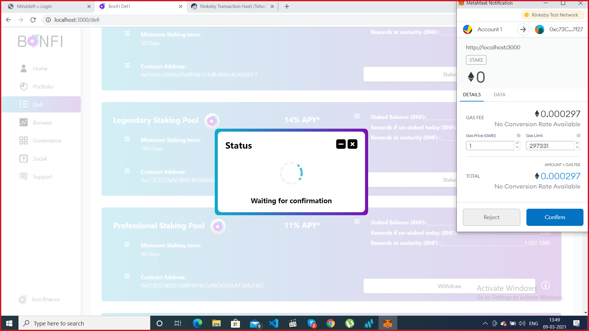

# Staking\(Contd\)

**Step 4:** After the transaction is successful, please click on the Confirm button and wait for the transaction to be confirmed.

Transaction is confirmed and the tokens are staked in the pool.

Please note if the allowance to the pool is given already then staking can be done directly with just one transaction.

