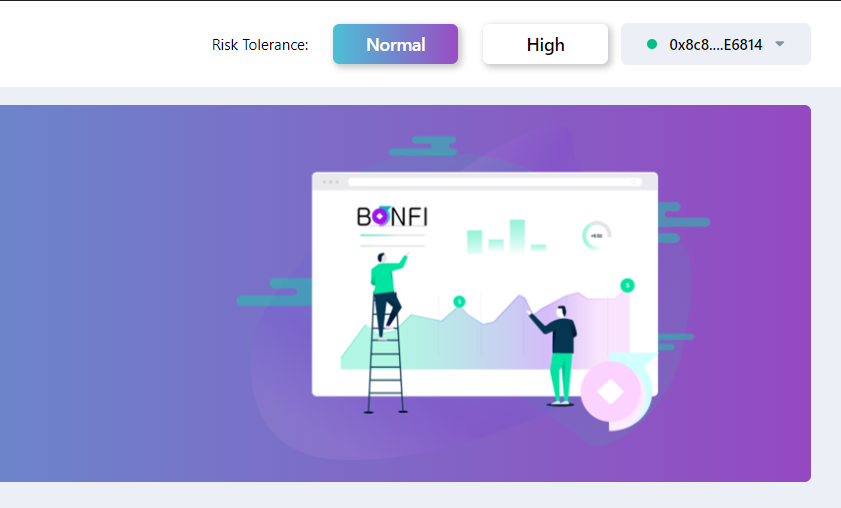

# Wallet

**Step 1:** Connect with your favourite wallet. \(MetaMask, WalletConnect\) by clicking on the UserName button.

Wallet Connect functionality.  

Click on the WalletConnect option and scan the QR code with any WalletConnect compatible wallet.

